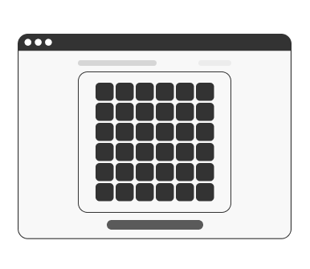
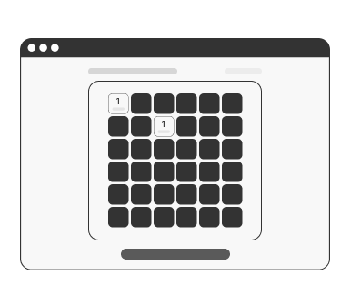
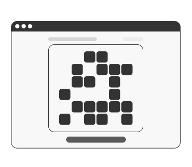
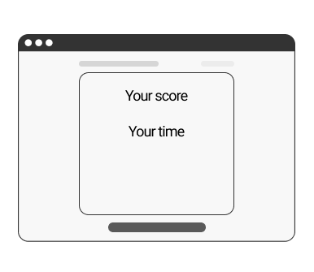
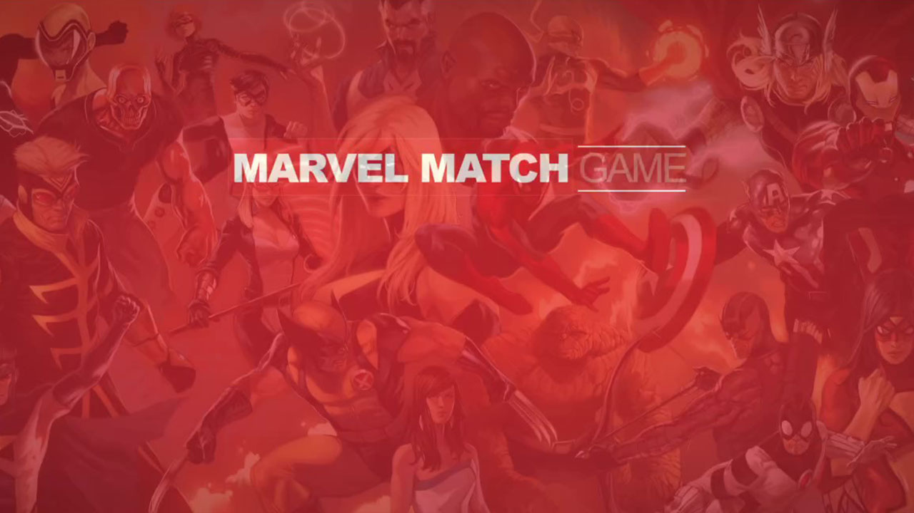
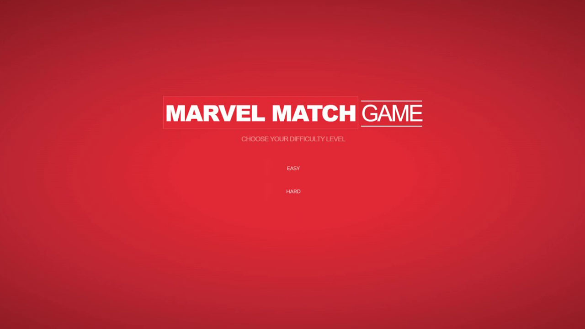
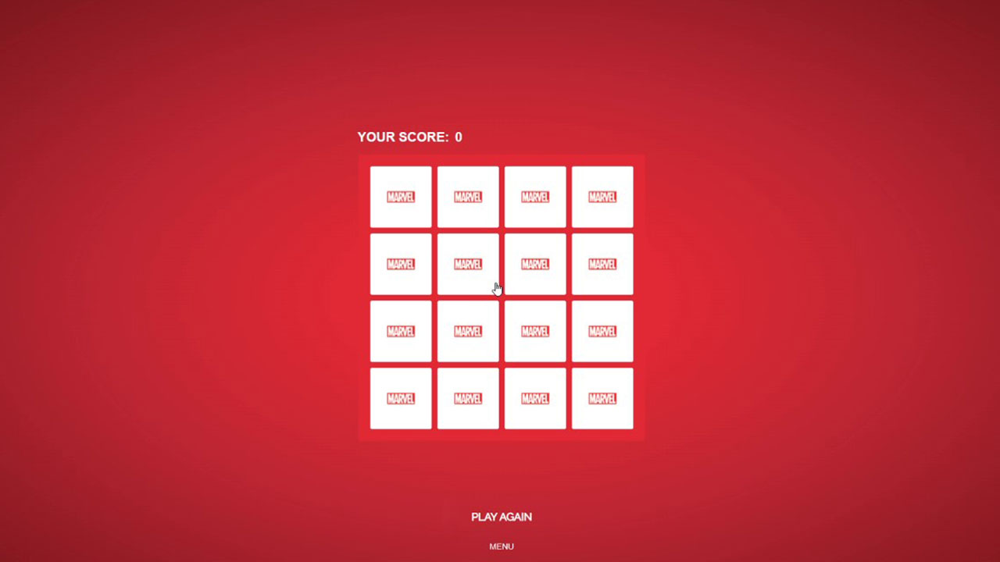
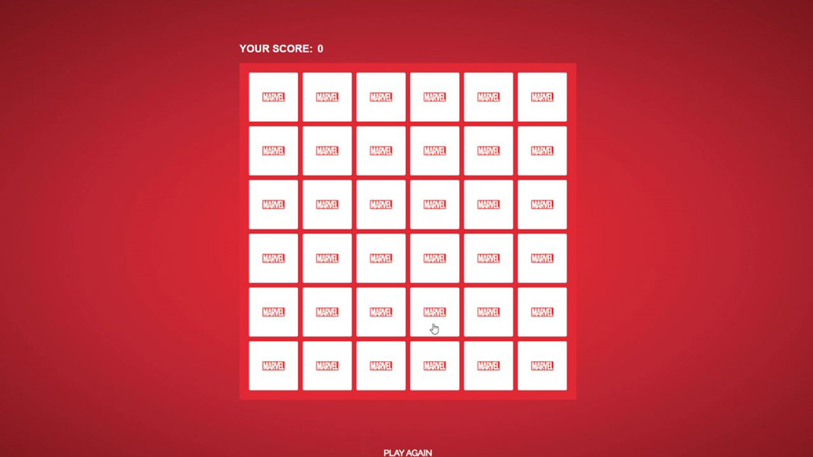
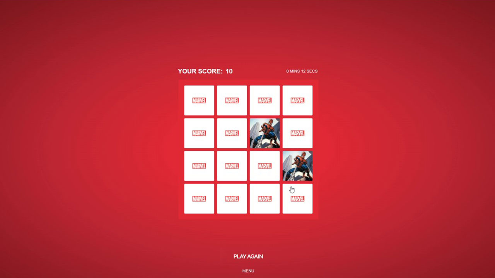
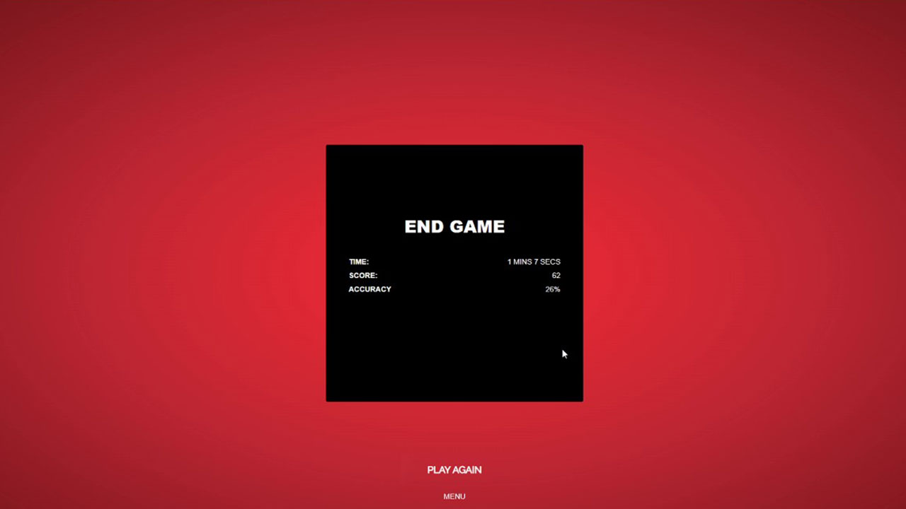

# Marvel Match Game

## Pitch:
Game rules!

Look for pairs of cards by turning them over 2 at a time. If you find a match, you get 10 points. When a match is unsuccessful, 1 point is deducted from your scoreboard. The goal is to have highest number of points in the shortest amount of time!

This game also comes in two difficulty levels. Level easy consists of a four by four grid of tiles. Level hard is a six by six grid. I gave it a marvel theme and for images I gathered comics artwork of marvel superheroes and villains.  

[Link to game here](https://romanprotoliuk.github.io/marvel_match_game/)

## Tech Stack:

HTML, CSS (flexbox, grid), Vanilla JavaScript

## MVP GOALs
When I began to brainstorm on this project my initial MVP goals were:
- To have 6x6 grid layed out
- with cards upside down,
- on click cards turn over 2 at a time,
- if not a match turn two cards over and try again,
- after three unsuccessful match shave some time off the timer,
- timer working,
- reset button,
- when timer is done show some kind of a popup for players results,
- keep a point system of how many maches a player got,
- after each reset shuffle cards.

I met all my MVP goals with a slight change of direction. For example, at the time I didn't know for sure what to do with my time feature. I didn’t know If I should have a set time that counts down and the user has to get as many matches as possible for that set amount of time. I decided to actually start the time and have it running for the whole game until it’s over. 

## STRETCH Goals
I was able to meet almost all my stretch goals. I needed a bit more time to fully implant mobile friendly layouts. 
- two levels: Hard - 6x6 grid, Easy - 4x4 grid.
- mobile friendly layout
- Marvel themed
- Sound when there's a match

## Potential Roadblocks
- reshuffling cards algorithm,
- after three unsuccessful match shave some time off the timer,
- if not a match turn two cards over and try again.

The process of making this game started off with just a 6x6 grid. Then I started to implement basic styling, and right after that basic DOM. In a matter of a few days I had the 6x6 grid and inside it with the help of CSS I got the tiles to turn over on click. Next I started to think about the logic of the game and how it would actually function under the hood. In the beginning I hard coded an array with 18 unique number (36 in total). I found the Fisher-Yates Algorithm that can randomly shuffle the array. 

```javascript
const shuffle = (arr) => {
	for (let i = arr.length - 1; i > 0; i--) {
		const j = Math.floor(Math.random() * (i + 1));
		const temp = arr[i];
		arr[i] = arr[j];
		arr[j] = temp;
	}
	return arr;
};
```
next thing I did was to add event listeners to my grid. So each time user clicks a tile it logged to the console the unique id of the tile. And then after that I worked the logic of the game. Comparing tiles for a match, checking and keeping track of clicks, matching winning conditions, point system, and accuracy

For my design I was inspired by this codepen [Marvel Codepen](https://codepen.io/samswartz/pen/RjVPPW) - I was able to customize this into my own project and its needs. Also I was inspired by this [Button Codepen](https://codepen.io/dmensinger/pen/PPRzpK) button design and I implemented it into my own project .

I am proud of this snippet of code below becasue it was really nice to see my logic and my ui come together. It can probably be written more efficient, but I love looking back at it beacause it definitely shows how much I've learned over the last three weeks, and also I am sure that this piece of code will be a good reference to look back at after a year or two and it will help me see how much better I've become. 

```javascript
easyClickCard.forEach((item, i) => {
	item.addEventListener('click', () => {
		userClicksEasy++;
		filterArr(item);
		toggleOnClick(item);
		item.style.pointerEvents = 'auto';
		inputAttributeInTileLevelEasy(item, i);
		if (clickedArrNum.length === 2) {
			document.body.style.pointerEvents = 'none';
			if (clickedArrNum[0].lastElementChild.style.cssText === clickedArrNum[1].lastElementChild.style.cssText) {
				matchedEasy();
			} else if (
				clickedArrNum[0].lastElementChild.style.cssText !== clickedArrNum[1].lastElementChild.style.cssText
			) {
				notMatched();
			}
			setTimeout(() => {
				scoreBoardEasy.innerText = scoreEasy;
			}, 700);
		}
		checkWinEasy();
	});
});
```

These were original wireframe design






This is what I've built








Overall the game is functional. There is a small bug when a user opens tiles two fast they can get stuck in an open position. Happens in rare cases. This is something that I would work on for version 2. Also for version 2 I would make it more mobile friendly with a better user design. 

I enjoyed working on this project. I pushed myself to the limits and learned alot!


